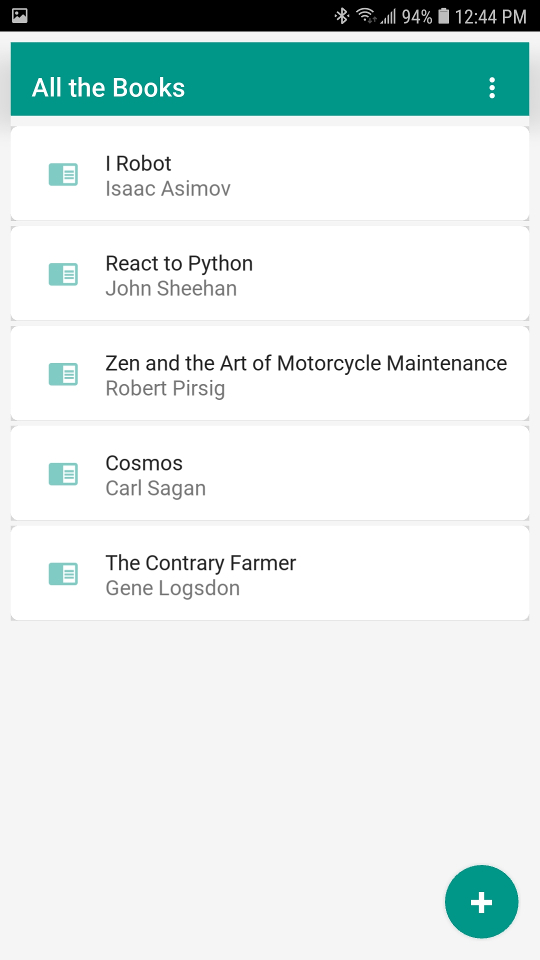
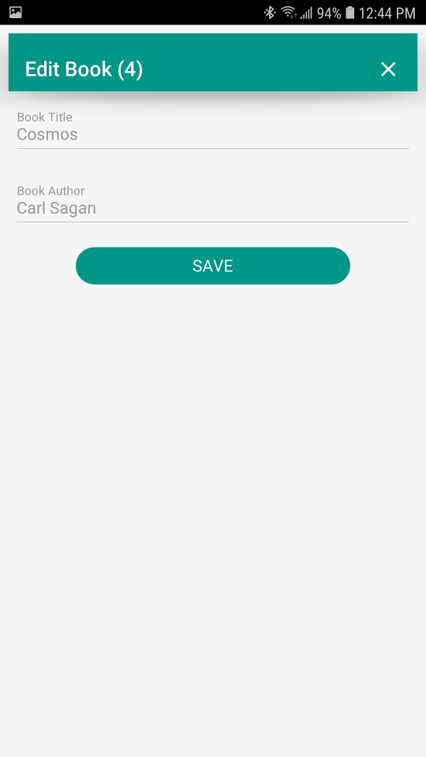
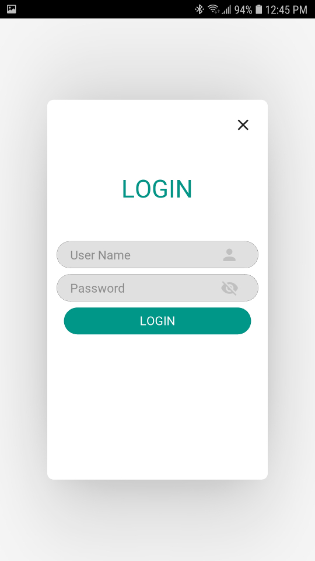
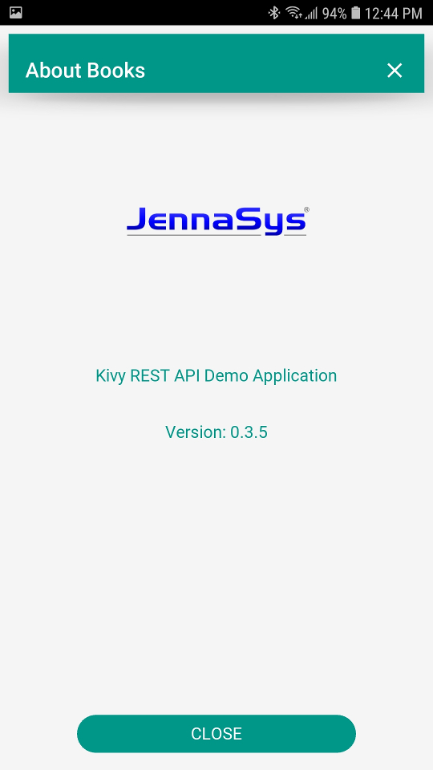
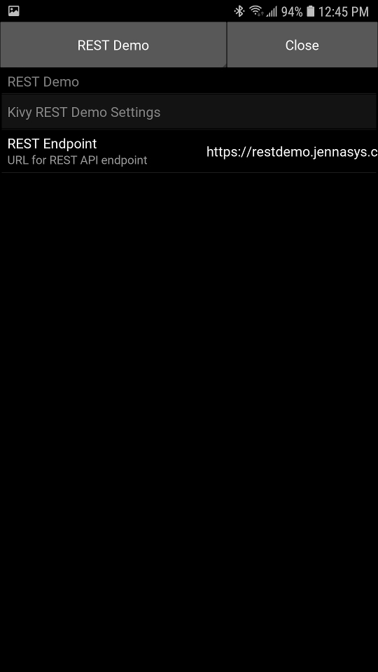

# Kivy REST API Demo Application
A [Kivy](https://kivy.org) based CRUD demo application that makes use of a full REST API (via HTTP GET, POST, PUT, and DELETE) 

### Features
- Uses [KivyMD](https://kivymd.readthedocs.io/en/latest/) v1.0.0-dev Material Design inspired widgets
- Connects to a deployed version of the [IEPUG demo REST API](https://github.com/IEPUG/2022_07_REST-API_2) by default
- The REST API endpont can be changed via settings in the app if you want to run it locally
- Data additions/edits/deletions are only allowed with an authenticated session
- Can run as-is on any platform that supports Python
- Android (see below) and iOS (not tested) builds can be compiled with [buildozer](https://buildozer.readthedocs.io/en/latest/index.html)

### Screenshots

### Android APK
The APK for the most recent debug build can be downloaded from the [GitHub Workflow section](https://github.com/JennaSys/kivy_rest/actions/workflows/main.yml). Look for the artifacts from the most recent build.
